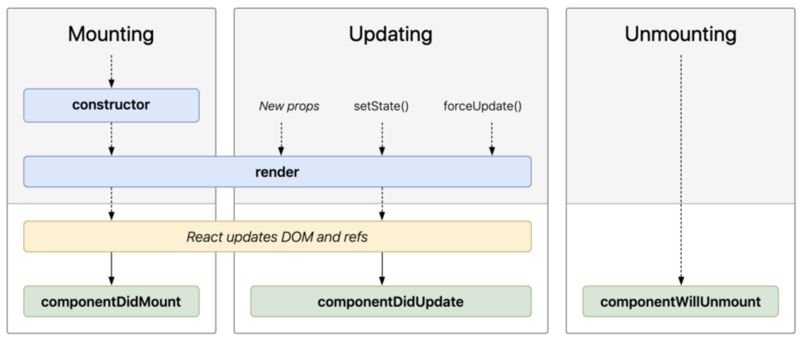

# React 설치를 위해서 필요한 것들(Node.js & Visual Studio Code)
## Node.js

### Node.js 란?

리액트 프로젝트를 만들기 위해서 Node.js와 npm을 먼저 설치해야 하는데 Node.js를 받을 때 npm도 같이 설치된다.<br/>
Node.js란 크롬 V8 자바스크립트 엔진으로 빌드한 자바스크립트 런타임으로서, **웹 브라우저 환경이 아닌 곳에서도** 자바스크립트를 사용하여 연산할 수 있다.

### React 설치 시 Node.js가 필요한 이유

리액트 앱은 웹 브라우저에서 실행되는 코드여서 Node.js와 직접적인 연관은 없지만, 프로젝트를 개발하는데 주요 도구들이 Node.js를 사용하기 때문에 필요하다.<br/>
이 때 사용하는 개발 도구는 바벨, 모듈화된 코드를 한 파일로 합치고 코드를 수정할 때 마다 웹 브라우저를 리로딩하는 등 여러 기능을 지는 웹팩 등이 있다.

### Node.js 설치 방법

1. 검색 엔진에서 [Node.js](https://nodejs.org/ko/) 검색
2. 다운로드 > 안정적, 신뢰도 높은 버전으로 설치
3. 설치 확인
```bash
$ node -v
```

## Visual Studio Code

### Visual Studio Code란?

비주얼 스튜디오 코드(Visual Studio Code)는 마이크로소프트(Microsoft)에서 오픈소스로 개발하고 있는 소스 코드 에디터이다. 웹 기반 기술들로 데스크톱 애플리케이션을 만들 수 있는 깃허브(GitHub)의 일렉트론(Electron)을 기반으로 만들어져 맥OS(macOS), 리눅스(Linux), 윈도우(Windows) 등 메이저 운영체제를 모두 지원하고 있다. 마이크로소프트의 통합 개발 환경(IDE) 비주얼 스튜디오(Visual Studio)와 이름이 비슷하지만 따로 개발되고 있으며 IDE보다는 코드 에디터에 가깝다. MIT 라이센스로 오픈소스로 공개되어 있으며, 무료로 사용할 수 있다.

### Visual Studio Code 설치 방법

1. 검색 엔진에서 [visual studio code](https://code.visualstudio.com/) 검색
2. 다운로드

# 리액트 앱 설치 방법

### 웹팩이란?

웹팩은 오픈 소스 자바스크립트 모듈 번들러로써 여러개로 나누어져 있는 파일들을 하나의 자바스크립트 코드로 압축하고 최적화하는 라이브러리이다.

### 웹팩(Webpack)의 장점은?

1. 여러 파일의 자바스크립트 코드를 압축하여 최적화할 수 있기 때문에 로딩에 대한 네트워크 비용을 줄일 수 있다.
2. 모듈 단위로 개발이 가능하며, 가독성과 유지보수가 쉽다.


### 바벨(Babel)이란?

최신 자바스크립트 문법을 지원하지 않는 브라우저들을 위해서 최신 자바스크립트 문법을 구형 브라우저에서도 돌 수 있게 변환 시켜주는 라이브러리이다.

### create-react-app

create-react-app을 사용하여 리액트를 설치하면 Babel이나 Webpack 설정이 이미 다 되어있기 때문에 많은 시간이 걸리지 않고 리액트 앱을 시작할 수 있다.

1. 리액트 앱을 만들 폴더 생성
2. 터미널 실행

```
$ npx create-react-app ./
```

### npx란?

npx는 노드 패키지 실행을 도와주는 도구이다. 그래서 create-react-app이란 npm 레지스트리에 있는 패키지를 해당 폴더에서 실행해서 리액트를 설치해 준다.

- npm 레지스트리(registry): 라이브러리들이 저장된 곳

# SPA(Single Page Application) 이란?

웹 사이트의 전체 페이지를 하나의 페이지에 담아 동적으로 화면을 바꿔가며 표현

# JSX(Javascript syntax extension)

JSX는 자바스크립트의 확장 문법이다. 리액트에서는 이 JSX를 이용해서 화면에서 UI가 보이는 모습을 나타내준다.<br/>
JSX를 이용하면 UI를 나타낼 때 자바스크립트(logic)와 HTML 구조(markup)를 같이 사용할 수 있기 때문에 기본 UI에 데이터가 변하는 것들이나 이벤트들이 처리되는 부분을 더욱 쉽게 구현할 수 있다.<br/>
자바스크립트 안에서 UI 작업을 하는데 편리하여 React를 사용할 때는 대부분 JSX를 사용한다.

# JSX Key 속성

리액트에서 요소의 리스트를 나열할 때는 Key를 넣어줘야 한다.<br/>
Key는 React가 변경, 추가 또는 제거된 항목을 식별하는데 도움이 된다. 요소에 안정적인 ID를 부여하려면 배열 내부의 요소에 키를 제공해야 한다.

### Key에는 유니크한 값을 넣어 준다.

index도 0부터 시작해서 유니크한 값을 가지지만 만약 리스트가 추가되거나 제거되면 해당 리스트들의 key 값도 바뀌게 된다.

# React State

컴포넌트의 렌더링 결과물에 영향을 주는 데이터를 갖고 있는 객체. state가 변경되면 컴포넌트는 리렌더링(Re-rendering) 된다. 또한 state는 컴포넌트 안에서 관리된다.

# 전개 연산자(Spread Operator) [...]

전개 연산자는 ECMAScript6(2015)에서 새롭게 추가되었으며, 특정 객체 또는 배열의 값을 다른 객체, 배열로 복제하거나 옮길 때 사용한다.

```javascript
// 배열 조합
const arr1 = [1, 2, 3];
const arr2 = [4, 5, 6];

const arrWrap = arr1.concat(arr2);
console.log(arrWrap) // [1, 2, 3, 4, 5, 6]

// 전개 연산자 활용
const arrWrap = [...arr1, ...arr2];
console.log(arrWrap) // [1, 2, 3, 4, 5, 6]

// 객체 조합
const obj1 = {
  a: "A",
  b: "B"
};
const obj2 = {
  c: "C",
  d: "D"
}

const objWrap = {obj1, obj2};
console.log(objWrap);

// 객체 자체가 들어간다.
{
  obj1: {
    a: "A",
    b: "B"
  },
  obj2: {
    c: "C",
    d: "D"
  }
}

// 전개 연산자 활용
const objWrap = {...obj1, ...obj2};
console.log(objWrap);

// 객체 자체가 아닌 각각의 값이 할당된다.
{
  a: "A",
  b: "B",
  c: "C",
  d: "D"
}
```

기존 배열을 보존

```javascript
const arr1 = [1, 2, 3];

// 원본 배열까지 역순으로 변경
const arr2 = arr1.reverse();
console.log(arr1); // [3, 2, 1]
console.log(arr2); // [3, 2, 1]

// 원본 배열 유지
const arr2 = [...arr1].reverse();
console.log(arr1); // [1, 2, 3]
console.log(arr2); // [3, 2, 1]
```

# React Hooks

## React Hooks는 무엇인가?

React Hooks는 ReactConf 2018 에서 발표된, class 없이 state를 사용할 수 있는 새로운 기능이다.

## React Hooks가 필요한 이유

항상 기술은 그 전의 것에 불편함이나 문제점을 해결하기 위해 발전한다.<br/>
그와 같이 React Hooks도 주로 Class Component로 사용되어온 React에 느껴왔던 불편함이나 문제점들을 해결하기 위해서 개발되었다. 원래 React는 Class Component를 사용하고 React Hooks는 Functional Component를 사용했다.

### React Component

Class Component | Functional Component
:--:|:--:
더 많은 기능 제공 | 더 적은 기능 제공
더 긴 코드 양 | 짧은 코드 양
더 복잡한 코드 | 더 심플한 코드
더딘 성능 | 더 빠른 성능

```javascript
// Class Component
import React, { Component } from 'react';

export default class Hello extends Component {
  render() {
    return (
      <div>
        Hello!
      </div>
    )
  }
}
```

```javascript
// Functional Component
import React from 'raact';

function Hello() {
  return (
    <div>
      Hello!
    </div>
  )
}
```

### 리액트의 생명주기(Lifecycle)



1. mount(생성)
2. update(재렌더링)
3. unmount(삭제)

생명주기를 함수형 컴포넌트에서는 사용을 하지 못했기 때문에 함수형 컴포넌트가 더 간결하고 빠르더라도 클래스형 컴포넌트를 사용했으나, **React 16.8 Hooks 업데이트**로 함수형 컴포넌트에서도 생명주기를 사용할 수 있기에 데이터를 가져오고 컴포넌트를 시작하자마자 API도 호출하는 등의 많은 부분을 할 수 있게 되었다.

### useEffect

```javascript
// 1. 재렌더링마다 코드를 실행
useEffect(function() {});

// 2. mount시 1회 코드를 실행
useEffect(function() {}, []);

// 3. unmount시 1회 코드를 실행
useEffect(function() {
  return function() {}
});

// 4. 특정 state 변경시에만 실행
useEffect(function() {}, [state명]);
```

Class Component 에서는 생명주기를 이용할 때 componentDidMount, componentDidUpdate, componentWillUnmount 이렇게 다르게 처리를 해주지만, 리액트 훅을 사용하면 useEffect 안에서 다 처리를 해줄 수 있다.

## state & props

### state

1. 해당 컴포넌트 내부에서 데이터를 전달
2. state는 변경 가능(mutable)
3. state가 변하면 re-render

### props (properties)

1. props는 상속하는 부모 컴포넌트로부터 자녀 컴포넌트에 데이터 등을 전달하는 방법
2. props는 읽기 전용(immutable)으로 자녀 컴포넌트 입장에서는 변하지 않는다. (변하게 하고자 하면 부모 컴포넌트에서 state를 변경시켜줘야 한다.)

# 구조 분해 할당 (Destructuring)

배열이나 객체의 속성을 해체하여 그 값을 개별 변수에 담을 수 있게 하는 Javascript 표현식